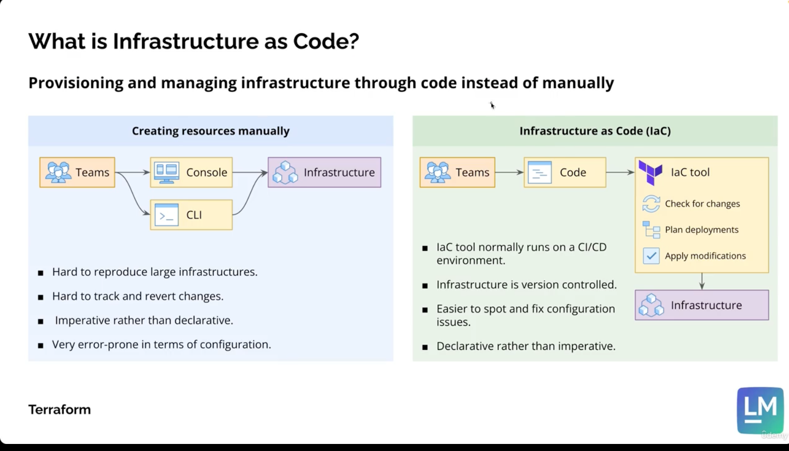
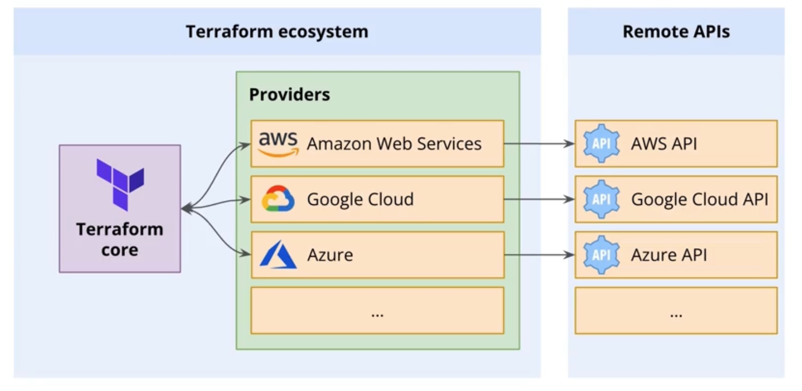
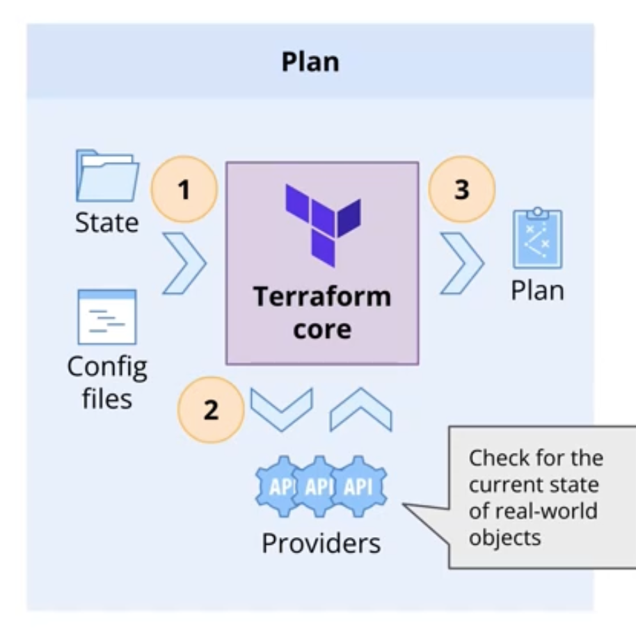
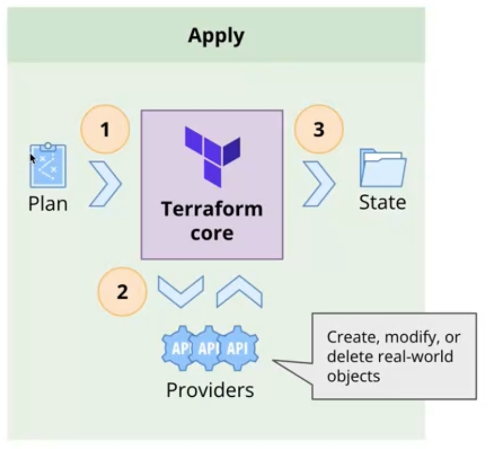
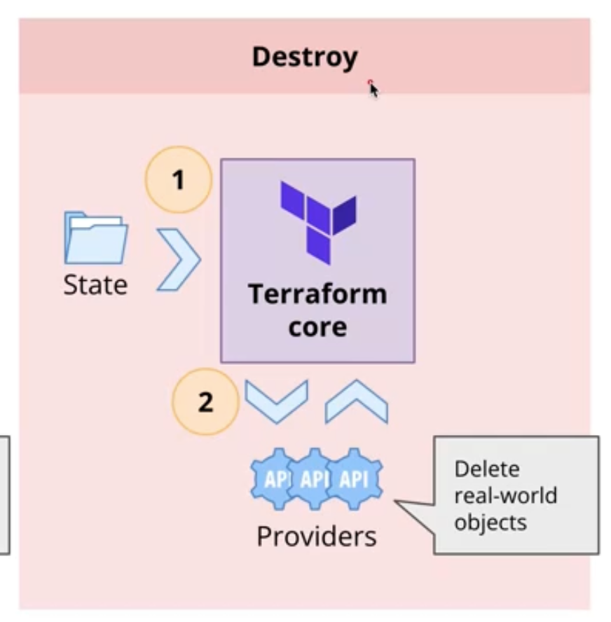

# What's IAC

- **IaC: Provisioning and managing Infrastructure through code instead of manually.**

- **Traditional Manually Console Operation Issues**
  * Hard to reproduce large infrastructure.
  * Hard to track and revert changes. 
  * Imperative rather than declarative. 
  * Very error-prone in terms of configuration. 
  
- **Terraform Benefits vs. Traditional Manually Console Operations**
  * IaC tools normally runs on a CI/CD environment. 
  * Infrastructure is version controlled. 
  * Easier to spot and fix configuration issues. 
  * Declarative rather than imperative. 

**Infrastructure as Code(IaC)** is a practice in DevOps where infrastructure configurations are managed and provisioned using code. This approach replaces manual processes for configuring hardward or cloud resources, enabling: 

- **Version Control**: Track changes to infrastructure like you do with application code. 
- **Automation**: Provision and manage infrastructure with scripts instead of manual actions. 
- **Consistency**: Reduce configuration drift and ensure environments are predictable. 
- **Efficiency**: Deploy and scale infrastructure faster using repeatable scripts. 

There are series of IaC tools: **Terraform**, **AWS CloudFormation**, **Ansible**, and **Pulumi**. 

---

## What's Terraform 
**Terraform** is an open-source Infrastructure as Code tool developed by HashiCorp. It allows you to define, manage, and provision cloud and on-premises infrastructure using declarative configuration files. 

### Terraform Key Features
- **Provider Agnostic**: Supports AWS, Azure, GCP, and many other providers. 
- **State Management**: Keeps track of our infrastructure's current state in a state file.
- **Modular Design**: Allows us to create reusable modules for common infrastructure components. 
- **Declarative Syntax**: Define "what" we want instead of "how" to do it using **HashiCorp Configuration Language(HCL)**.
- **Plan and Apply**: Preview changes before applying them to our infrastructure. 

### Why Use Terraform? 

Advantages of Terraform over other Infrastructure-as-Code tools.

- **Platform-agnostic**: Terraform can be used with multiple providers, both in the cloud and on-premises.
- **High-level abstraction**: Terraform can be used to manage resources across multiple providers.
- **Modular Approach**: We can create modules grouping resources, and then combine and compose these modules to build a
  bigger solution.
- **Parallel Deployment**: Terraform builds a dependency graph of resources and supports parallel changes.
- **Separation of plan and apply**: We can execute only plan commands to inspect the potential changes before actually
  applying them.
- **Resource protection & validation**: Terraform Provides several ways to protect resources against accidental changes
  or deletion, as well as ways of validating the deployed infrastructure.
- **State file**: Terraform is very fast due to its implementation of a state file, saving the entire snapshot of the
  current deployment.

### Terraform's Architecture

How does Terraform manage resources in so many different places?

- **Terraform Providers**: allow Terraform to know how to interact with remote APIs.
- **Providers** provide the logic to interact with upstream APIs:
  - Read, create, update, and delete resources through that provider's API.
- Anyone can write and publish a provider for a remote API, as long as it follows Terraform specifications.
- We declare the necessary providers in the Terraform project configuration, and Terraform installs those providers
  during initialization.

### Terraform's Provisioning Infrastructure
How does Terraform provision and manage infrastructure? 

#### Phase of Plan 

* First of all we have our configuration file, and any previous state may already exist regarding infrastructures managed by terraform. 
* Terraform then takes those {config files, state files} inputs and call the remote APIs to check for the current state of real-world objects. 
* Then, the Terraform will receive the information from the provider's side about the real-world's current state of objects. 
* After receiving the provider side's real world object's state, it will compare with the return data with both the state and the config files. 
* If any differences are detected by the comparing stage, Terraform will output a plan of changes that gonna to be executed during the phase of Apply.  

#### Phase of Apply 

* During phase of apply, Terraform first receives the **Plan** which is generated in previous **Plan Phase**. 
* There should some resources' modifications in the Plan like Create, modify, or delete real-world objects, Terraform extract those changes and wrap the changes into request to interact with remote provider's APIs correspondingly .  
* To the remote provider side, it receives the change requests and executes the changes, and then after successful change it will respond the successful reply messages back to the Terraform side. 
* Then, after Terraform side receives the modify success messages it will save the current state to the **State** to consistent the current infrastructure state to disk or memory.  

#### Phase of Destroy 

* Creation, modification are stored in the **State** files, and during the phase of Destroy Terraform will first look into the State file for all the configurations.
* Then Terraform will interact once again with the providers to execute the necessary API calls to delete real-world objects. 

--- 

## What's AWS CloudFormation 
**AWS CloudFormation** is a service provided by Amazon Web Service(AWS) that enables you to define and provision AWS resources using templates. It's AWS's native IaC tool.

### AWS CloudFormation Key Features 
- **Declarative Templates**: Use YAML or JSON to define the desired state of AWS resources. 
- **Integration**: Seamlessly works with other AWS services. 
- **Stack Management**: Group related resources into stacks for easier management. 
- **Drift Detection**: Identify changes to resources that deviate from the template. 

### Why Use AWS CloudFormation?
* Automate the setup of complex AWS environments.
* Maintains consistency across deployments. 
* Supports compliance by enforcing approved configuraitons. 

--- 

## Benefits that Terraform Bring

### Better cost management

* Resources, environments, and complex infrastructures can ben easily created and destroyed. 
* Automation considerably frees up the time of developers and infrastructure maintainers. 
* Tagging strategies and requirements can be easily implemented across entire infrastructure. 
* It becomes much easier to obtain an overview of all resources created by a specific IaC project. 

### Improved reliability
* Well-developed IaC tools guarantee a consistent behavior. 
* IaC tools provide multiple ways to deploying configurations: locally, as part of a CI/CD pipeline, triggered via API calls. 
* IaC tools validate infrastructure configuration as part of the deployment process. 

### Improved consistency & scalability
* Infrastructure can be easily copied and deployed multiple times with the same structure. 
* Modules can be created and made publicly or privately available. 
* Different environments can be created based on the same / similar configuration files. 
* Resource counts can be easily increased or decreased when needed. 

### Improved deployment process
* Automation saves a lot of time and effort when deploying infrastructure. 
* Prevents configuration drift by identifying and reverting unexpected changes. 
* Creating, updating and destroying resources becomes fullly integrated with other CI/CD tasks. 
* Changes to infrastructure are version controlled, being easier to revert in case of incompatibility or error. 
  
### Fewer human errors
* The planning stage shows all the changes that are expected to be carried out, and can be inspected by engineers. 
* Connecting and integrating different resources becomes more intuitive due to developer-friendly identifiers. 
* Many IaC tools support validators and interigy checks with the custom conditions. 
* Many IaC tools support protection rules agains deletion of critical resources. 
  
### Improved security strategies. 
* Validation and integrity checks can be used to ensure the infrastructure compiles with security requirements. 
* Shared infrastructure modules are normally maintained by teams with a strong focus on securing these resources.  
* Security strategies(for example, IAM users, roles and their respective policies) can also be configure via IaC tools.  
* The infrastructure configuration files can be inspected by security software for vulnerabilities. 

### Self documenting infrastructure
* The created infrastructure is the infrastructure documented in the code. 
* Many IaC tools allows detailed inspection of the resources created. 
* Run logs are normally stored for a period of time, allowing inspection in case of any errors or unwanted changes. 

