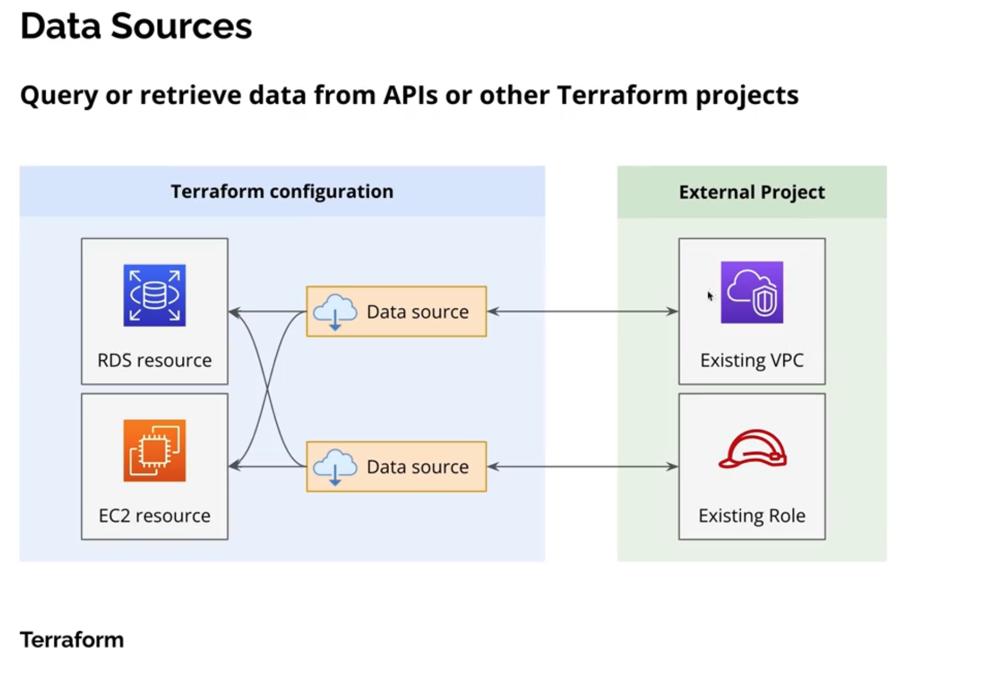

# Notes for Terraform: _Data Sources_

## Data Sources in Terraform Scope enables query or retrieve data from APIs or other Terraform projects.

- **Use-Case**: Retrieve data from infrastructure that is not managed by the current Terraform project. 