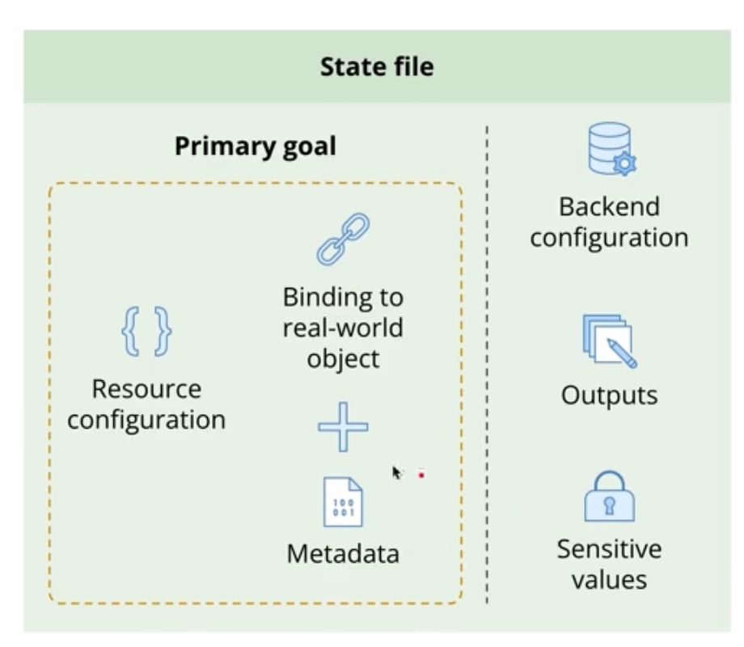

# Terraform State

Terraform State maps resources from the configuration to real-world objects.

The primary goal of the **Terraform State** is trying to hold the **Resource Configuration** as well as the bindings
between the **Resource Configuration** and the **real-world objects** that was generated by deploying our terraform
project.

* State is always required in Terraform.
* **Important** The state contains extremely sensitive data, so be careful regarding who has access to it.
* The state file also stores metadata, such as resource dependencies, so that Terraform knows in which order resources
  must be created, updated, or deleted.
* Before any planning operation, Terraform refreshes the state with the information from the respective real-world
  objects.
    * This is essential to avoid configuration drift. If a real-world object has been modified outside of Terraform and
      the respective configuration has not been updated, Terraform will revert the changes.
* State can be either stored locally(default) or in several remote backends(S3, Google Cloud Storage, Terraform Cloud, among others).  
* **State locking**: locks the state while executing write operations to prevent concurrent modifications and state corruption. 

--- 

## Configuration Drift

### What is Configuration Drift ?
* It's when the real-world infrastructure no longer matches the state declared in your Terraform files. 
* Example: Someone manually changes a security group rule in AWS, bypassing Terraform. 

### How Does Terraform Detect Drift ? 
* BY running `terraform plan`, Terraform compares the actual state (via provider APIs) with its state file. 
* Drift shows up as a "change" in the plan even if yu didn't update the Terraform configuration. 

### What Are Common Cause of Drift ? 
* Manual changes to resources via a provider's UI/CLI.
* Automated scripts modifying infrastructure outside Terraform. 
* State file inconsistencies (e.g., missing updates or corruption).

### How Can Drift Impact Terraform Projects ? 
* Applying plans may overwrite manual changes or cause conflicts. 
* Drift can lead to unpredictable behavior or downtime during deployments.

