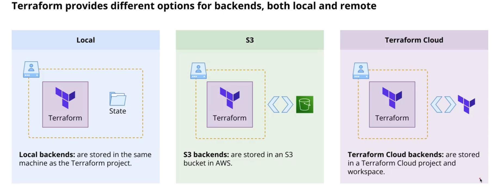

# Backends in Terraform

**Backends define where Terraform stores its state file**

There are multiple types of backends, which can be place into three categories:

- **Local**: the state file is stored in the user's local machine.
- **Terraform Cloud**: the state file is stored in Terraform Cloud. Offers additional features.
- **Third-party remote backends**: the state file is stored in a remote backend different from Terraform Cloud (for
  example S3, Google Cloud Storage, Azure Resource Manager/Blob Storage, among others).

Different backends can offer different functionalities (for example, state locking is not available for all remote
backends) and require different arguments. 

A Terraform configuration can provide only one backend. 

The `backend` block cannot use any input variables, resource references, and data sources.

Remote backends requires authentication credentials in order for Terraform to properly access the files.

When changes are made to the configured backend, we must return the `terraform init` command.

Terraform offers the possibility of migrating state between different backends. 