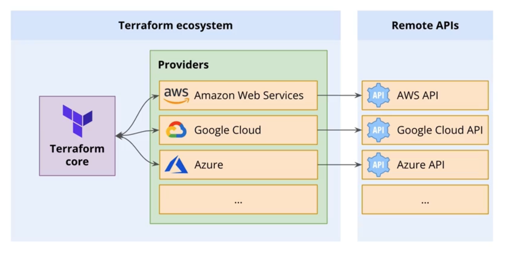

# Notes for Terraform's Providers

## **Providers are how Terraform interacts with remote APIs and platforms**

- Each provider adds a set of resource types and data sources that the Terraform project can use.
- Providers are developed and maintained separately from Terraform. They fit into Terraform's plugin architecture.
- The Terraform configuration must declare all the providers it requires.
- Provider configurations belong to the root module of a Terraform project. Child modules receive their provider
  configuration from the parent module.
- We can use the same version constraints as when specifying the Terraform version, and we can create a dependency lock
  file to ensure that the exact versions of providers are installed.   