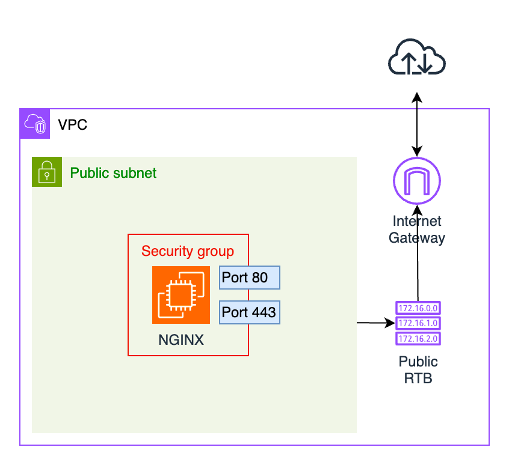

# Deploying an NGINX Server in AWS

In this project, we will be deploying an NGINX server in AWS. We will create a new VPC, set up public and private
subnets, and deploy EC2 instance using the Ubuntu AMI. Later, we will replace the instance with an NGINX Bitnami AMI and
associate it with a security group. Finally, we will test website accessibility and tag the resources with project
information. Make sure to use Terraform for as many resources as possible, and remember to delete all the resources at
the end of the project to avoid unnecessary costs. 

## Project Overview 

--- 

## Desired Outcome

- Deploy a new VPC in AWS in the region of your choice. 
- Within the VPC, deploy a public and private subnet. 
  - **Hint**: The public subnet should be associated with a custom route table containing a route to an **Internet Gateway**. 
- Create a security group that allows traffic only on ports 80 (HTTP) and 443(HTTPS).
- Deploy an EC2 instance in the public subnet using the Ubuntu AMI. 
- Delete the previous instance and deploy another EC2 instance using the NGINX Bitnami AMI, since it's free of charge. 
- Associate the deployed NGINX instance with the created security group, and confirm that it's possible to access the website via its public IP.
  - **Hint**: You will probably get a certificate error if access via `https://`. It's safe to ignore the error and proceed to the website.
- Tag resources with useful information about your project. 
- Make sure to delete all the resources at the end of the project. 